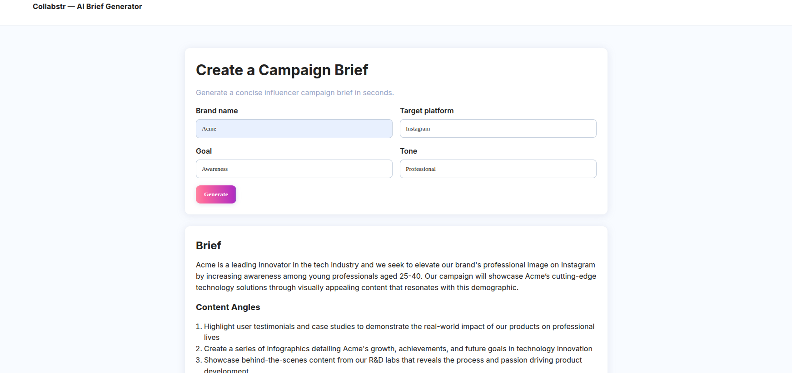

# Collabstr AI Brief Generator

A minimal Django app that generates a short influencer campaign brief using a hosted LLM via Groq (configurable model). It demonstrates clean orchestration, prompt design, light guardrails, and telemetry, with a Collabstr‑adjacent single‑page UI.

## Screenshot


## Tech Stack
- **Backend**: Django 5
- **LLM**: Groq API (`GROQ_MODEL` default: `llama-3.1-8b-instant`)
- **Frontend**: HTML/CSS/JS + jQuery

## Project Structure
- `collabstr_ai/` – Django project (settings, urls)
- `brief/` – App with API endpoint, templates, and static assets
  - `views.py` – `generate_brief_endpoint()` and `home()`
  - `services/llm.py` – Groq chat completion call and JSON parsing + latency metrics
  - `validators.py` – Input validation + profanity filter
  - `templates/index.html` – Single‑page UI
  - `static/js/app.js` – jQuery AJAX + rendering
  - `static/css/style.css` – Collabstr‑adjacent light theme (Inter font, gradient CTA)

## Setup (Local)
1. Install dependencies (uv or pip):
   ```bash
   # uv
   uv sync
   # or pip
   pip install -r requirements.txt
   ```

2. Create `.env` (see `.example.env`) with at least:
   ```env
   GROQ_API_KEY=your_groq_key
   GROQ_MODEL=llama-3.1-8b-instant
   DEBUG=True
   ALLOWED_HOSTS=127.0.0.1,localhost,0.0.0.0
   CSRF_TRUSTED_ORIGINS=http://127.0.0.1:8001,http://localhost:8001,http://0.0.0.0:8001
   ```

3. Initialize DB and run:
   ```bash
   uv run python manage.py migrate
   uv run python manage.py runserver 0.0.0.0:8001
   # Open http://127.0.0.1:8001
   ```

## API
- POST ` /api/generate_brief`
  Request JSON:
  ```json
  {
    "brand": "Acme Skincare",
    "platform": "Instagram|TikTok|UGC",
    "goal": "Awareness|Conversions|Content Assets",
    "tone": "Professional|Friendly|Playful"
  }
  ```
  Response JSON:
  ```json
  {
    "brief": "...4–6 sentences...",
    "angles": ["...", "...", "..."],
    "criteria": ["...", "...", "..."],
    "metrics": {
      "latency_ms": 1234,
      "usage": {"prompt_tokens": 0, "completion_tokens": 0, "total_tokens": 0}
    }
  }
  ```

## Prompt Design Choices
- **System prompt** (`brief/services/llm.py::SYSTEM_PROMPT`):
  - Enforces: 4–6 sentence concise brief; then 3 content angles; then 3 creator criteria.
  - “Avoid fluff; tailor to inputs.”
- **User prompt**: compact, built from the four inputs; requests a single JSON object with `brief`, `angles`, `criteria`.
- **Determinism**: temperature set to 0.3 and output constrained to JSON; angles/criteria clamped to three items server‑side for stability.

## Guardrails Implemented
- **Input validation** (`brief/validators.py`):
  - Allowlists for `platform`, `goal`, `tone`.
  - Brand required and basic profanity filter.
- **Rate‑limiting**: `@django_ratelimit.decorators.ratelimit(key='ip', rate='10/m', block=True)`.
- **Generation limits**: `num_predict=500`, `temperature=0.3` in the Ollama client.
- **Server‑side validation** of parsed JSON, with safe fallbacks.

## Metrics: Tokens and Latency
- **Latency**: measured around the LLM call using `time.perf_counter()`; returned as `metrics.latency_ms`.
- **Token usage**: populated from Groq’s response (`prompt_tokens`, `completion_tokens`, `total_tokens`).
- **Frontend**: renders latency and token metrics in the result card.

## Frontend Behavior
- Single page (`/`) with 4 inputs and a Generate button.
- On submit: disables button, shows loading, sends AJAX to `/api/generate_brief` with CSRF header.
- Renders:
  - Brief paragraph (4–6 sentences)
  - 3 numbered content angles
  - 3 bulleted creator selection criteria
  - Metrics (latency and token placeholders)

## Styling Notes
- Collabstr‑adjacent light theme: Inter font, soft borders, subtle shadows, gradient primary button.
- Styles live in `brief/static/css/style.css`. Typography is loaded via Google Fonts in `templates/index.html`.
- You can refine colors and spacing to match assets under `tmp/` if desired.

## Deploy
- Live demo: https://drimyus.pythonanywhere.com/
- Host options: PythonAnywhere (free), Hugging Face Spaces (Docker), Render/Railway/Fly (credit card may be required).
- Required env vars in production:
  - `DJANGO_SETTINGS_MODULE=collabstr_ai.settings`
  - `DEBUG=False`
  - `ALLOWED_HOSTS=<your-domain>` and `CSRF_TRUSTED_ORIGINS=https://<your-domain>`
  - `DJANGO_SECRET_KEY=<random-strong-secret>`
  - `GROQ_API_KEY=<your_key>` and optional `GROQ_MODEL`

### PythonAnywhere (summary)
1. Bash console:
   ```bash
   git clone https://github.com/<you>/<repo>.git
   cd <repo>
   python3 -m venv ~/.virtualenvs/llm-demo
   source ~/.virtualenvs/llm-demo/bin/activate
   pip install -r requirements.txt
   python manage.py collectstatic --noinput
   python manage.py migrate
   ```
2. Web tab:
   - Manual config (Python 3.x)
   - Virtualenv: `~/.virtualenvs/llm-demo`
   - WSGI: point to `collabstr_ai.wsgi`
   - Static: map `/static/` → `/home/<you>/<repo>/staticfiles`
   - Environment: set variables listed above
   - Reload and open your domain

## Deliverables Checklist
- Public GitHub repo link
- README (this file) with:
  - Prompt design choices
  - Guardrails
  - How tokens/latency are measured
  - Short Loom demo (< 1 minute) of the feature
- A live, public webpage URL to test the generator

## Quick Troubleshooting
- **Port in use**: run server on `0.0.0.0:8001`.
- **Bad Request (400)**: ensure `ALLOWED_HOSTS` includes your host and visit via `http://127.0.0.1:8001` in dev.
- **CSRF errors**: ensure you loaded `/` first so the CSRF cookie is set; AJAX sends `X‑CSRFToken`.
- **Groq errors**: check `GROQ_API_KEY` and network access.
